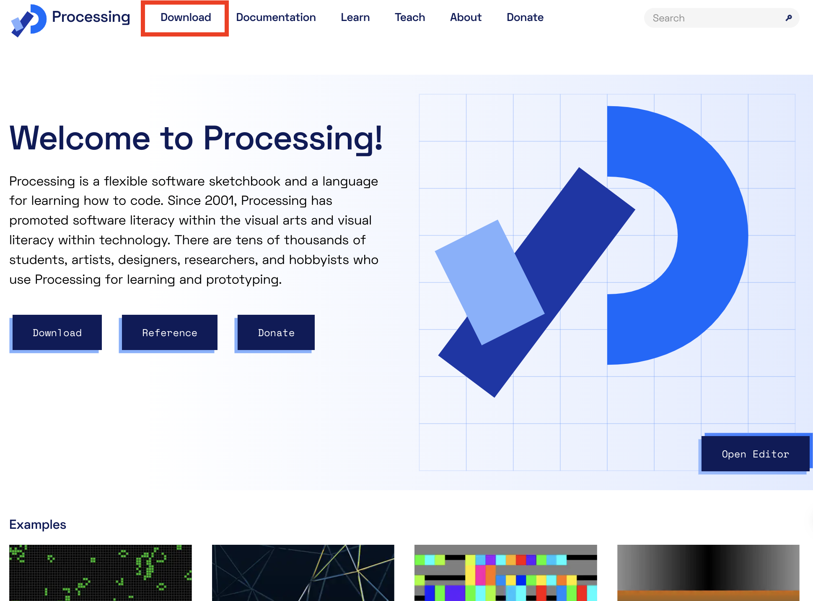
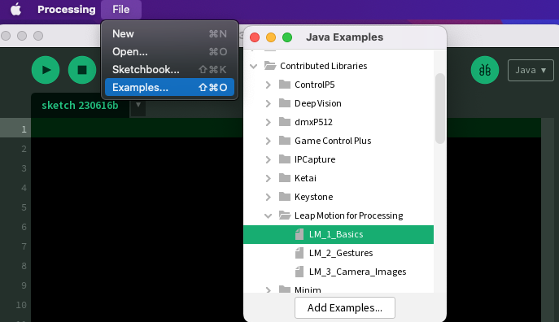

<!-- _class: lead -->
# Leap Motion setup guide
---
# はじめに

2023年現在，LeapMotionの販売元である現UltraLeap社が提供している最新SDKでは，LeapMotion(V1)はサポートされていない様です．

このセットアップガイドでは，古いバージョンのSDKを使用し，LeapMotion(V1)をProcessingで使える様にする方法について書かれています．

また，CPUがApple Silicon版のMacや，グラフィックボードが付いていないWindowsでは，動作しない可能性があるので，ご了承ください．

- 本ガイドのセットアップ環境
  - Mac：MacBook Pro 2.7 GHz クアッドコアIntel Core i7, macOS Monterey
  - Win：2.5 GHz Intel Core i5-10300H, Windows11, RTX-2060

※現在，自分の環境で発生した問題として，一度接続が切れるとPCを再起動しないと再接続できない症状が出ています．

---
# LeapMotionの接続確認

LeapMotionがPCに正しく接続されると，LeapMotionのデバイスに内部のLEDが赤く点灯します．下記のインストール手順を完了しても赤く光らない場合は，LeapMotionを接続したまま，**PCを再起動**してみて下さい．

---

<!-- _class: lead -->
# Mac（intel）

---
<!--  -->
## SDK＆ドライバ　ダウンロード
LeapMotion用の古いドライバーとSDKをダウンロードします．
ドライバーのバージョンは1.6.1, SDKは2.3.1で動作しました．
ネットから同バージョンのものをダウンロードしてくるか，
こちらの[Google Drive](https://drive.google.com/drive/u/0/folders/1ibALHyGajFMoMm7Yjr28qkeV_9w-vbHW)から下記ファイルをダウンロードして下さい．

 
ドライバー：PL2303_MacOSX_1.6.1_20160309.pkg

SDK：LeapDeveloperKit_2.3.1+31549_mac2.zip

---
PL2303_MacOSX_1.6.1_20160309.pkgを開き，ドライバーをインスロールします．
インストール後，念のためMacを再起動させ，SDKのzipを開き，中に入っているLeapMotionのインストーラ(.dmg)を起動させLeapMotionのアプリをインストールします．

 
インストールが完了したらLeaoMotionをMacに接続し，下記アプリケーションを起動します．すると画面上のメニューバーにLeapMotionが追加され，デバイスが検出されると緑色になるので，Visualizerを起動してLeap Motionが動作するか確認しましょう．

<image src="img/fig13.png" width=200></image> アプリケーション　　　<image src="img/fig14.png" width=270></image> メニューバー

---
## Processingで動作確認
Visualizerで動作が確認できたら，ProcessingでLeapMotion Libraryをインストールして動作を確認してみましょう．
Processing > Sketch > Manage Libraries > 検索[Leap] > Leap Motion for Processing

<image src="img/fig15.png" width=1200>

---
<!-- <image src="img/fig16.png" width=800> -->

Examples > LM_1_Basicsを開き，手が認識されれば成功です．

---
<!-- _class: lead -->
# Windows
---
## SDK＆ドライバ　ダウンロード
LeapMotion用の古いドライバーとSDKをダウンロードします．
ドライバーのバージョンは3.2.1で動作しました．
ネットから同バージョンのものをダウンロードしてくるか，
こちらの[Google Drive](https://drive.google.com/drive/u/0/folders/1ibALHyGajFMoMm7Yjr28qkeV_9w-vbHW)から下記ファイルをダウンロードして下さい．

 
ドライバー：Leap_Motion_Orion_Setup_win_3.2.1.exe
---

---

# References
