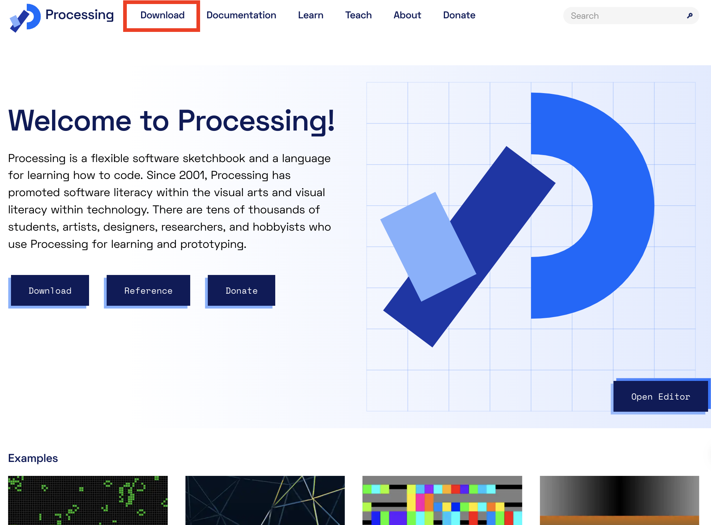

<!-- _class: lead -->
# Processingダウンロードから課題提出まで
---
<!-- _class: lead -->
# Mac

---


## ダウンロード
[Processing公式サイト](https://processing.org)の[Downloadページ](https://processing.org/download)から，所有のMacOSに応じてアプリをダウンロードする．
<br><br>

Intel または Apple silicon
<image src="img/fig01.png" width=400></image>

---
## アプリケーションの管理場所
ダウンロードしてきたZipファイルを開く．
解凍したProcessing.appをアプリケーションフォルダへドラックして移動させる．
Macでは基本このアプリケーションフォルダでアプリを管理するのが望ましい．
<br>
<image src="img/fig02.png" width=800></image>

---
## プログラムの保存
Macは初期設定で書類(Documents)に”Processing”フォルダが作られる．

プログラムを保存する際は，Proicessingフォルダの中に授業毎にフォルダを作成し保存すると良い．

```
書類/Processing/授業名/kadai01
```
保存が完了するとフォルダ内に`.pde`ファイルが作成される．

<image src="img/fig03.png" width=1000></image>

---
## プログラムの提出
### pdeファイルで提出
pdeファイルで提出指定があった場合は，フォルダ内の`.pde`ファイルをそのまま提出する．
```
kadai01/kadai01.pde ⇦提出
```

### zipファイルで提出
zipで提出する場合は，`.pde`ファイルが入っているフォルダをzipにして提出する．
```
kadai01をzipで提出する場合，kadai01フォルダごとzipにまとめる．

kadai01/kadai01.pde
kadai01.zip　⇦提出
```

---
<!-- _class: lead -->
# Windows
---


## ダウンロード
[Processing公式サイト](https://processing.org)の[Downloadページ](https://processing.org/download)から，WIndows版アプリをダウンロードする．
<br><br>
<image src="img/fig04.png" width=400></image>

---
## アプリケーションの管理場所
ダウンロードしてきたZipファイルを展開し，フォルダの中にもう1つProcessingフォルダが入っている．このフォルダをCドライブの`Program Files`にドラックして移動する．
<image src="img/fig05.png" width=1000></image>

---
<image src="img/fig06.png" width=1000></image>
Windowsではこの`Program Files`フォルダでアプリケーションを管理するのが望ましい．移動させたprocesingフォルダ内に`processing.exe`があるので**ショートカット**をデスクトップに作成するか**タスクバーにピン留め**をするとよい．
<font color="red">**フォルダ内からprocessing.exeを直接他フォルダへ移動させるのはダメ！**</font>
<image src="img/fig07.png" width=1000></image>


---
## プログラムの保存
 Windowsは初期設定でドキュメントに”Processing”フォルダが作られる．
プログラムを保存する際は，Proicessingフォルダの中に授業毎にフォルダを作成し保存すると良い．<font color="red">**(フォルダやファイル名に日本語を使用しないこと！)**</font>

```
ドキュメント/Processing/ClassName/kadai01
```
<image src="img/fig09.png" width=800></image>
保存が完了するとフォルダ内に`.pde`ファイルが作成される．


---
## プログラムの提出
### pdeファイルで提出
pdeファイルで提出指定があった場合は，フォルダ内の`.pde`ファイルをそのまま提出する．
```
kadai01/kadai01.pde ⇦提出
```

### zipファイルで提出
zipで提出する場合は，`.pde`ファイルが入っているフォルダをzipにして提出する．
```
kadai01をzipで提出する場合，kadai01フォルダごとzipにまとめる．

kadai01/kadai01.pde
kadai01.zip　⇦提出
```

---
<!-- _class: lead -->
# よくあるトラブル

---
### pdeファイルが開けない
.pdeファイルだけではProcessingのIDEで開くことはできないため，ダウンロードしてきたpdeファイルなどを開くときには下記の様なポップアップが表示されるか，pdeファイルが開けない事がある．
その時は，**Move**を選択するか．自分でpdeファイルと同名のフォルダを作成しその中にpdeファイルを入れてあげる必要がある．

<image src="img/fig10.png" width=800></image>

---
### processingフォルダを標準ディレクトリ以外で管理したい時の注意点

初期設定時に作成されるProcessingフォルダをデスクトップなどで管理したいときに注意する点として以下が挙げれる．
- 全角文字やスペースをディレクトリ名に入れない
(悪例： /大学/三年　後期/Processing/プログラミング　1/課題01/課題01.pde)
(良例： Documents/Processing/Programming1/Exercises/ex01/ex01.pde)
- **設定(Preferences)のフォルダパスを変更，確認する．**
<image src="img/fig11.png" width=800></image>
  


---
# References
- [Yasushi Noguchi Class](https://r-dimension.xsrv.jp/classes_j/start/)
- [プログラミングとゲームの杜](https://www.greenowl5.com/gprogram/processing/processing020.html)

- [CodeAid-Lab](https://codeaid.jp/processing-jp/)
