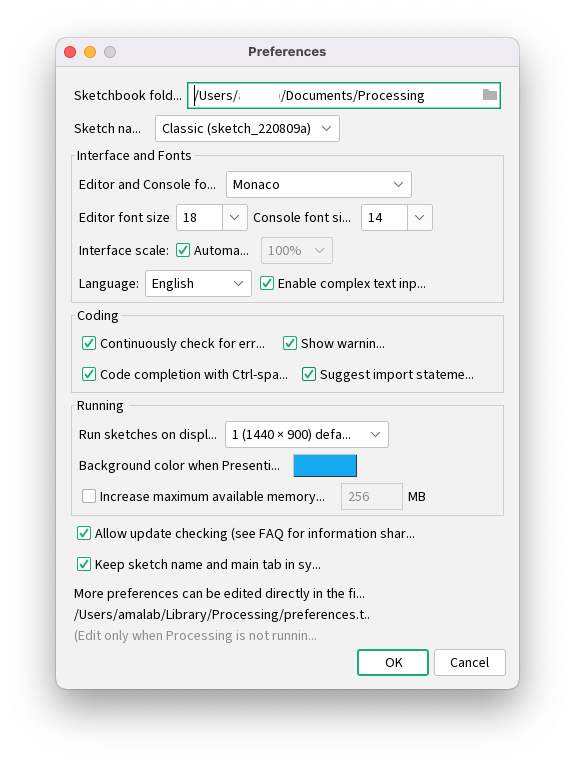

<!-- _class: lead -->
# Processingでよく使うショートカットや設定
---
## よく使うショートカット
- 実行（Mac：command+'r'　/ Win：control+'r'）
- 停止（escape）
- 保存（Mac：command+'s'　/ Win：control+'s'）
- オートインデント（Mac：command+'t'　/ Win：control+'t'）
- コメントアウト（Mac：command+'/'　/ Win：control+'/'）

---
## 設定

Mac：画面右上の🍎横のProcessingから**Preferences**を開く

Win：スケッチ右上のファイルから**設定**を開く

- フォントの変更
- フォントサイズの変更
- 言語設定
- コード補完(Code completion)

など設定できる．コード補完は入れておくと便利です．